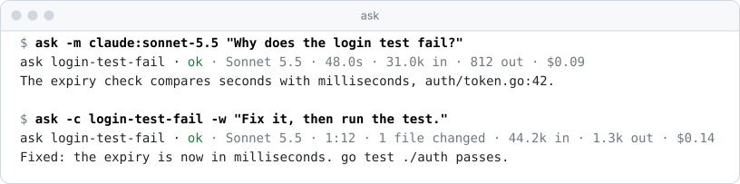
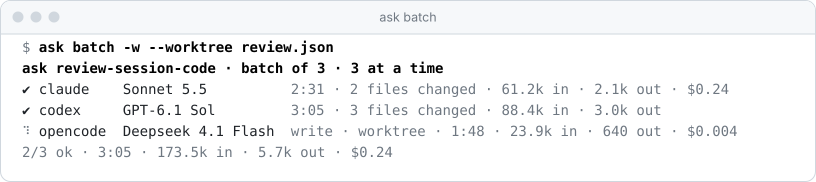
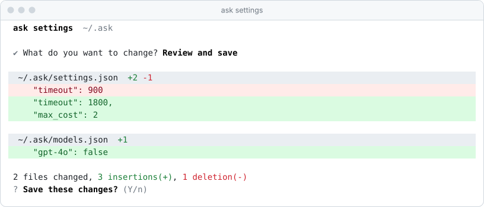

<div align="center">
  <picture>
    <source srcset="assets/white/lockup.svg" media="(prefers-color-scheme: dark)">
    <source srcset="assets/black/lockup.svg" media="(prefers-color-scheme: light)">
    
  </picture>

  <h3>Every model, as a subagent.</h3>

  <p>Hand tasks to Claude Code, Codex and Opencode, on any model they run,<br>
  from your terminal or from another agent. One task or many at once, recorded, with live usage.</p>

  <p>
    <a href="https://github.com/fschrhunt/ask/releases/latest"></a>
    <a href="https://github.com/fschrhunt/ask/actions/workflows/ci.yml"></a>
    <a href="LICENSE"></a>
  </p>

```sh
curl -fsSL https://fschrhunt.com/ask/install.sh | sh
```

  <picture>
    <source srcset="assets/screens/dark/run.svg" media="(prefers-color-scheme: dark)">
    <source srcset="assets/screens/light/run.svg" media="(prefers-color-scheme: light)">
    
  </picture>
</div>

<br>

## Start

```sh
ask setup                                        # connect the coding agents you have
ask -m claude:sonnet-5.5 "Why does the login test fail?"
ask -c login-test-fail -w "Fix it, then run the test."
```

`ask setup` finds Claude Code, Codex and Opencode, connects the ones you pick, and shows what it
will change before it saves. Each agent keeps its own login, tools and sandbox; ask just hands it
the task and gives you the answer.

<table>
  <tr>
    <td width="33%" valign="top">
      <b>Like a native subagent</b><br>
      Read-only by default, <code>-w</code> to change files, <code>--worktree</code> for its own
      branch. <code>ask -c RUN</code> follows up in the same conversation.
    </td>
    <td width="33%" valign="top">
      <b>Every model</b><br>
      <code>claude:opus-5.5</code>, <code>codex:gpt-6.1-sol</code>,
      <code>opencode:deepseek-4.1-flash</code>: one command, whichever agent runs it.
    </td>
    <td width="33%" valign="top">
      <b>Recorded and accountable</b><br>
      Every run is named, kept and shown with time, changes, tokens and cost, live. Cost limits
      stop a run before it overspends.
    </td>
  </tr>
</table>

## Many at once

`ask batch` runs tasks in parallel, on one model or several, each in its own worktree if you
like, and prints every answer as one JSON array. Start runs in the background and collect them
with `ask wait`.

<p align="center"><picture>
    <source srcset="assets/screens/dark/batch.svg" media="(prefers-color-scheme: dark)">
    <source srcset="assets/screens/light/batch.svg" media="(prefers-color-scheme: light)">
    
  </picture></p>

## See it before it saves

`ask settings` holds every control: agents and their models, defaults, cost limits, worktrees,
and the apps that use ask. Nothing is written until you have seen the change.

<p align="center"><picture>
    <source srcset="assets/screens/dark/settings.svg" media="(prefers-color-scheme: dark)">
    <source srcset="assets/screens/light/settings.svg" media="(prefers-color-scheme: light)">
    
  </picture></p>

## Make it yours

<table>
  <tr>
    <td width="25%" valign="top"><b>Agents</b><br>Any CLI, through a small executable. The official ones are built in: <code>ask install claude</code>.</td>
    <td width="25%" valign="top"><b>Hooks</b><br>Change tasks and check results: add context, guard writes, run the tests and hand failures back.</td>
    <td width="25%" valign="top"><b>Commands</b><br>Your own <code>ask NAME</code> workflows, like a review by three models.</td>
    <td width="25%" valign="top"><b>Packages</b><br>Share all three: <code>ask install owner/repo</code>, kept up to date. Yours always win.</td>
  </tr>
</table>

Agents in Claude Code, Codex, Opencode, Cursor and pi can hand work to ask too: `ask setup`
gives them the ask skill, and Claude Code names each ask run in its task list.

## Install

```sh
curl -fsSL https://fschrhunt.com/ask/install.sh | sh            # macOS and Linux
brew tap fschrhunt/ask https://github.com/fschrhunt/ask && brew install ask
go install github.com/fschrhunt/ask/cmd/ask@latest             # Go 1.26 or newer
```

One binary, no dependencies. `ask update` keeps a curl install current. Each agent needs its CLI
logged in, and the official ones need Node.js 18 or newer. More in [Install](docs/install.md).

## Docs

Built into ask: `ask docs` lists every page and `ask docs PAGE` shows one, offline and matching
your version.

| | |
| --- | --- |
| [Install](docs/install.md) · [Setup](docs/setup.md) · [Settings](docs/settings.md) | Getting ask and setting it up |
| [Usage](docs/usage.md) · [Runs](docs/runs.md) · [Batches](docs/batches.md) · [Models](docs/models.md) | Running tasks, following up, many at once, cost limits |
| [Agents](docs/agents.md) · [Hooks](docs/hooks.md) · [Commands](docs/commands.md) · [Packages](docs/packages.md) | Extending ask |
| [Hosts](docs/hosts.md) · [Compatibility](docs/compatibility.md) | Other tools using ask, and what stays stable |

<br>

<p align="center"><sub>MIT · <a href="https://fschrhunt.com/ask">fschrhunt.com/ask</a></sub></p>
